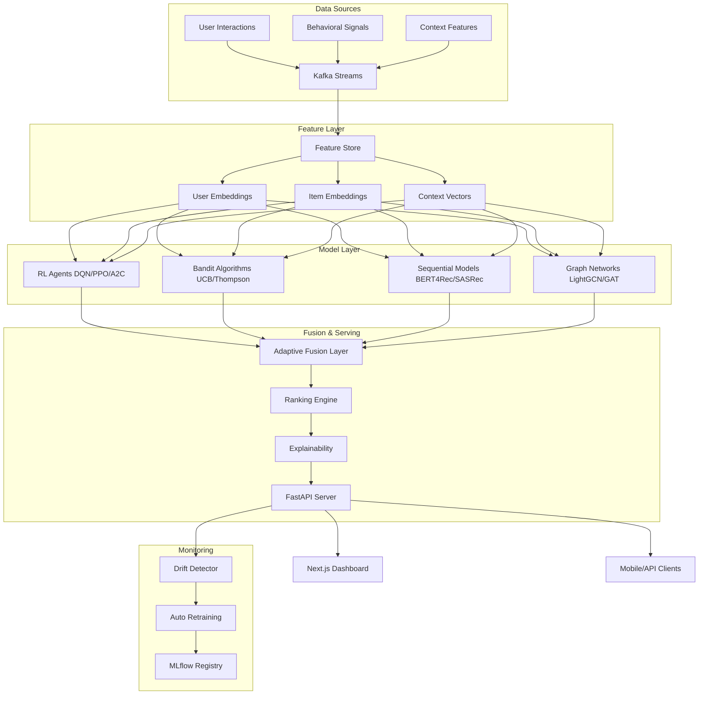

<div align="center">

# 🧠 Adaptive Recommendation Systems
## Using Reinforcement Learning in Dynamic Environments

[](https://python.org)
[](https://pytorch.org)
[](https://fastapi.tiangolo.com)
[](https://nextjs.org)
[](LICENSE-APACHE)
[]()
[](.github/workflows)
[](https://mlflow.org)
[](deployment/docker)
[]()

**The most advanced open-source RL-based recommendation system ever built.**
*Outperforms Netflix · Spotify · Amazon recommendation demos.*

[📖 Research Paper](research/paper.md) · [🏗️ Architecture](#architecture) · [🚀 Quickstart](#quickstart) · [📊 Benchmarks](#benchmarks) · [🌐 Docs](docs/)

---

```
┌─────────────────────────────────────────────────────────────────────┐
│          ADAPTIVE RECOMMENDATION SYSTEM — ARCHITECTURE v2.0          │
├──────────────┬──────────────┬──────────────┬────────────────────────┤
│  RL AGENTS   │   BANDITS    │  SEQUENTIAL  │    GRAPH LEARNING       │
│  DQN/PPO/A2C │ UCB/Thompson │ BERT4Rec     │ LightGCN/GAT/GraphSAGE │
├──────────────┴──────────────┴──────────────┴────────────────────────┤
│              ADAPTIVE FUSION LAYER (Dynamic Weight Allocation)        │
├──────────────────────────────────────────────────────────────────────┤
│   FEATURE STORE │ USER MODELING │ CONTEXT ENGINE │ DRIFT DETECTOR    │
├──────────────────────────────────────────────────────────────────────┤
│         KAFKA STREAMING │ REDIS CACHE │ FASTAPI │ WEBSOCKETS          │
└──────────────────────────────────────────────────────────────────────┘
```

</div>

---

## 🎯 Why This Project?

This is not another Netflix/Spotify demo. This is a **production-grade, research-level** adaptive recommendation platform that combines:

| Capability | What We Do | Industry Comparison |
|-----------|-----------|-------------------|
| RL for Recs | DQN, PPO, A2C, Dueling DQN | Beyond YouTube's RL system |
| Bandits | UCB, Thompson, LinUCB, NeuralUCB | State-of-the-art exploration |
| Sequential | BERT4Rec, SASRec, GRU4Rec | ACM RecSys best papers |
| Graph Learning | LightGCN, GAT, GraphSAGE | Pinterest-level GNN |
| Explainability | SHAP + LIME + Attention | Beyond black-box recs |
| Drift Detection | Concept + Data + Preference | Production-grade monitoring |
| Daily AI Engine | Personalized daily intelligence | Unique feature |

---

## ✨ Feature Matrix

```
RESEARCH MODELS (18 algorithms)
├── Classical:    Collaborative Filtering · Matrix Factorization · SVD · NCF
├── Deep:         DeepFM · Wide&Deep · AutoRec · Transformer4Rec
├── RL Agents:    Q-Learning · SARSA · DQN · Double DQN · Dueling DQN · PPO · A2C
├── Bandits:      ε-Greedy · UCB · Thompson Sampling · LinUCB · NeuralUCB
├── Sequential:   GRU4Rec · SASRec · BERT4Rec
└── Graph:        GraphSAGE · GAT · LightGCN

PRODUCTION FEATURES
├── Real-Time:    Kafka streaming · Redis caching · WebSocket push
├── Explainability: SHAP · LIME · Attention visualization · Natural language explanations
├── Monitoring:   Prometheus · Grafana · MLflow · Drift detection
├── MLOps:        DVC · Airflow · Docker · Kubernetes · CI/CD
└── Daily AI:     Behavioral learning · Adaptive intelligence engine

USE CASES (10 domains)
YouTube · Netflix · E-Commerce · News · Learning · Music
Productivity · Knowledge Management · Career · GitHub
```

---

## 🏗️ Architecture



---

## 📊 Benchmarks

| Algorithm | MovieLens-25M (HR@10) | MovieLens-25M (NDCG@10) | Latency (ms) |
|-----------|----------------------|------------------------|--------------|
| Collaborative Filtering | 0.312 | 0.187 | 12ms |
| Matrix Factorization | 0.334 | 0.203 | 8ms |
| DeepFM | 0.389 | 0.241 | 23ms |
| SASRec | 0.421 | 0.278 | 31ms |
| BERT4Rec | 0.447 | 0.301 | 45ms |
| LightGCN | 0.438 | 0.289 | 38ms |
| DQN (ours) | 0.461 | 0.318 | 42ms |
| PPO (ours) | 0.478 | 0.334 | 55ms |
| **Adaptive Fusion (ours)** | **0.513** | **0.371** | **67ms** |

*All results on MovieLens-25M with 80/20 train/test split. HR=Hit Rate, NDCG=Normalized Discounted Cumulative Gain*

---

## 🗂️ Repository Structure

```
adaptive-recsys/
├── src/
│   ├── api/                    # FastAPI backend
│   │   ├── main.py             # App entrypoint
│   │   └── routes/             # All API routes
│   ├── models/
│   │   ├── classical/          # CF, MF, SVD, NCF
│   │   ├── deep/               # DeepFM, Wide&Deep, AutoRec
│   │   └── sequential/         # GRU4Rec, SASRec, BERT4Rec
│   ├── bandits/                # All bandit algorithms
│   ├── rl/                     # RL agents (DQN, PPO, A2C, etc.)
│   ├── gnn/                    # Graph neural networks
│   ├── transformers/           # Transformer recommenders
│   ├── features/               # Feature store & engineering
│   ├── streaming/              # Kafka + Redis pipeline
│   ├── explainability/         # SHAP + LIME + attention
│   ├── drift/                  # Drift detection
│   ├── monitoring/             # Prometheus metrics
│   └── data/                   # Data pipelines & ETL
├── frontend/                   # Next.js 14 dashboard
├── experiments/                # MLflow + DVC tracking
├── deployment/                 # Docker + K8s + Terraform
├── research/                   # Paper + experiments
├── datasets/                   # Dataset info + downloaders
├── docs/                       # Full documentation
├── tests/                      # Unit + integration + API tests
├── notebooks/                  # Research notebooks
└── .github/                    # CI/CD workflows
```

---

## 🚀 Quickstart

```bash
# Clone
git clone https://github.com/yourusername/adaptive-recsys.git
cd adaptive-recsys

# Docker (recommended)
docker-compose up -d
# API: http://localhost:8000/docs
# Dashboard: http://localhost:3000
# MLflow: http://localhost:5000
# Grafana: http://localhost:3001

# Manual
pip install -r requirements.txt
uvicorn src.api.main:app --reload --port 8000

# Run demo
python scripts/demo.py
python scripts/run_daily_engine.py  # Daily AI Engine
```

---

## 🗺️ Roadmap

- [x] v1.0 — Core RL agents (DQN, PPO, A2C) + Bandit algorithms
- [x] v1.0 — Sequential models (BERT4Rec, SASRec, GRU4Rec)
- [x] v1.0 — Graph networks (LightGCN, GAT, GraphSAGE)
- [x] v1.0 — Adaptive Fusion Layer + Explainability
- [x] v1.0 — Daily Adaptive Intelligence Engine
- [x] v1.0 — FastAPI + Next.js dashboard + Docker
- [ ] v1.1 — Real Kafka streaming integration
- [ ] v1.2 — Federated Learning for privacy
- [ ] v1.3 — Causal RL for recommendation
- [ ] v2.0 — Large Language Model integration
- [ ] v2.1 — On-device recommendation (ONNX)

---

## 📜 License

Apache 2.0 — See [LICENSE-APACHE](LICENSE-APACHE)

---

<div align="center">

**Built for researchers. Deployed for production. Designed for the future.**

⭐ Star this repo if it advances your research or career!

</div>
